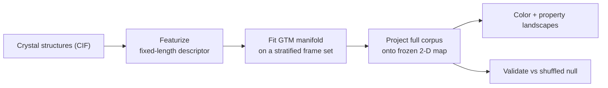
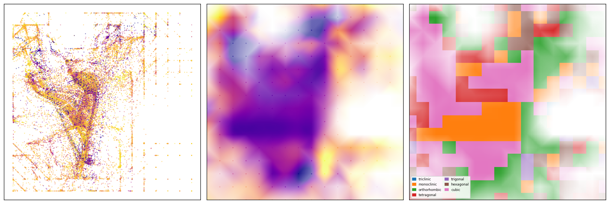

# matmercator

**Materials Space Cartography — A Generative Topographic Mapping of Inorganic Crystal Structures into Probabilistic 2D Property Maps and Landscapes**


> **Status: under active development.** This is an early, calibration-stage tool; the API, defaults, and reported values may change.

matmercator maps a dataset of crystal structures onto a two-dimensional representation of materials space. Each structure is encoded as a fixed-length descriptor (by default the Sine Coulomb Matrix). Generative Topographic Mapping (GTM), a probabilistic non-linear latent-variable model related to the Self-Organizing Map, fits a two-dimensional manifold to these descriptors on a representative *frame set*, freezes it, and projects the full corpus onto the fixed map, placing each structure at its responsibility-weighted mean position. The projected coordinates are colored by a property (band gap, formation energy, stability, or symmetry) to give a continuous property surface, and the resulting organization is assessed against a label-shuffled null. The pipeline is therefore: structure → 2D map → property surface.





**Figure 1 — matmercator on the MP-20 benchmark (45,229 inorganic crystals).** *Left:* the GTM embedding, each crystal at its responsibility-weighted position on the 2-D latent map, colored by DFT formation energy. *Middle:* the node-based formation-energy landscape, a continuous surface interpolated from per-node mean energies, with opacity gated by sampling density. *Right:* the same map partitioned by majority crystal system (legend inset).

## How it works

GTM is a probabilistic, non-linear latent-variable model related to the Self-Organizing Map. Each structure is represented on the map by a posterior ("responsibility") distribution over a `k × k` latent grid, and its 2-D coordinate is the responsibility-weighted mean node position. The three stages are:

1. **Featurize** (`featurize.py`) — each structure is reduced to a fixed-length descriptor. The default is the Sine Coulomb Matrix: the eigenvalues of a periodic Coulomb matrix, zero-padded to a common length. By default these are matminer's unsorted `eig` spectrum; setting `sort_eigenvalues=True` selects the canonical `eigh` ordering, which is a metric wash on MP-20 (see [Reproducibility](#reproducibility)).
2. **Frame-set selection** (`sampling.py`, `cartography.py`) — the per-EM-step cost of GTM scales as samples × latent nodes × dimensions, so the scaler and GTM are fit once on a stratified frame set (≥1 structure per occupied space group, then proportional allocation), frozen, and applied to the full corpus by projection. Projection cost is linear in the number of structures and independent of the fit, so the same procedure scales to large datasets.
3. **Color and validate** (`plots.py`, `landscape.py`, `metrics.py`) — projected points are colored by property to give point maps, and per-node mean properties are interpolated into continuous landscapes gated by node density, coherence, or applicability. Map quality is quantified against a label-shuffled null.

GTM is the core method and the descriptor is a replaceable stage. The SCM is an inexpensive baseline; additional descriptors (e.g. Orbital Field Matrix, MBTR) and an alternative manifold (Self-Organizing Map) can be added through the same module interfaces.

## Results

On the full MP-20 set (45,229 structures), map position is associated with every property tested: each observed statistic lies ~84–228σ above its label-shuffled null (200 permutations; `p ≤ 0.005` is the resolution floor of the test).

| Quantity | Observed | Null (mean ± sd) | z |
|---|---|---|---|
| Formation energy [eV/atom] | 0.137 | 0.008 ± 0.001 | 217 |
| Band gap [eV] | 0.101 | 0.008 ± 0.001 | 129 |
| E above hull [eV/atom] | 0.059 | 0.008 ± 0.001 | 84 |
| Crystal-system k-NN purity | 0.291 | 0.167 ± 0.001 | 228 |

The map accounts for roughly 6–14% of property variance, consistent with what a cheap, unsupervised descriptor compressed to two dimensions can capture. The result is a calibration baseline, not a property predictor: GTM does not use the properties during fitting, so coloring tests only whether structure-derived coordinates organize the physics. Full methodology, caveats, and metric-calibration checks are in [`results/mp20_scm_gtm/RESULTS.md`](results/mp20_scm_gtm/RESULTS.md).

## Quickstart

```bash
git clone https://github.com/vzordillo/matmercator.git
cd matmercator
conda create -n matmercator python=3.10 && conda activate matmercator
pip install -e .                         # installs the `matmercator` command + pinned stack

matmercator run --max-structures 300 --frame-set-size 150   # ~1-min smoke run
matmercator run                                             # full MP-20
```

Outputs are written to `results/mp20_scm_gtm/` (see [Outputs](#outputs)). For the development tools, install the extras: `pip install -e ".[dev]"`.

## Usage

A single `matmercator` command (installed by `pip install -e .`; also available as `python -m matmercator`) provides subcommands that share one configuration. The `scripts/*.py` files are thin wrappers that forward to it.

- **Single run** — `matmercator run [flags]`: load, featurize, and map in one process.
- **Selection** — `matmercator select`: rank GTM hyperparameters (k, m, s, regul) by cross-validated **Q²** across properties, writing `selection_report.json`. For this inexpensive unsupervised descriptor Q² is low and is best used for relative comparison.
- **Experiment** — `matmercator experiment`: compare descriptors (SCM, composition, and their union) by held-out Q², with a PCA-2D baseline and a cell-size confound check; the composition cache is built if absent. Writes `experiment_report.json` and `experiment.md`. For the full set: `matmercator features && matmercator experiment`.
- **Staged** — for large datasets, cache the CIF featurization once and build from the cache:

  ```bash
  matmercator features        # featurize all splits → results/cache/
  matmercator map             # build the map from the cache
  matmercator landscapes      # node-based landscapes from the cache
  matmercator hero            # render the README banner
  ```

  Every subcommand accepts the same flags and an optional `--config run.json` (a JSON config file; flags override it). The feature cache is descriptor-keyed (`cache.py`), so `map` and `landscapes` refuse to load a cache built with different descriptor settings.

### Parameters

One dataclass, `PipelineConfig` (`config.py`), is the single source of truth; the resolved configuration is written to `config.json` beside each run. The CLI exposes a subset as flags (last column); a full `--config` JSON file is also accepted.

| Group | Parameter | Default | CLI flag | Meaning |
|---|---|---|---|---|
| data | `data_root` | `<repo>/data` | `--data-root` | folder containing the dataset directories |
| data | `dataset` | `mp_20` | `--dataset` | dataset name |
| data | `splits` | `(train, val, test)` | `--splits` | splits loaded and concatenated |
| data | `frame_split` | `train` | — | frame set is drawn from this split only |
| data | `max_structures` | `None` | `--max-structures` | cap rows per split (`None` = all) |
| descriptor | `diag_elems` | `True` | — | include the SCM diagonal self-terms |
| descriptor | `sort_eigenvalues` | `False` | — | `True` = canonical `eigh` descending spectrum; `False` = matminer's unsorted `eig` |
| frame set | `frame_set_size` | `6000` | `--frame-set-size` | structures used to fit the manifold |
| frame set | `frame_strata` | `(spacegroup.number,)` | — | columns to stratify the frame set by |
| frame set | `standardize` | `True` | `--no-standardize` | z-score the descriptor (scaler fit on the frame set) |
| frame set | `random_state` | `1234` | `--seed` | random seed |
| GTM | `gtm_k` | `16` | `--gtm-k` | latent grid is `k × k` |
| GTM | `gtm_m` | `4` | — | RBF grid is `m × m` |
| GTM | `gtm_s` | `0.3` | — | RBF width factor |
| GTM | `gtm_regul` | `0.1` | — | weight regularization |
| GTM | `gtm_niter` | `200` | `--gtm-niter` | EM iterations |
| validation | `color_properties` | `band_gap, formation_energy_per_atom, e_above_hull` | — | properties colored & validated |
| validation | `grid_bins` | `20` | — | `G × G` binning for the η² metric |
| validation | `n_permutations` | `200` | `--n-permutations` | permutations for the null |
| validation | `knn_k` | `15` | — | neighbours for the crystal-system purity metric |
| output | `output_dir` | `results/mp20_scm_gtm` | `--output-dir` | output directory |

## Datasets

The CSV datasets are the CDVAE crystal-generation benchmarks (MP-20, Carbon-24, Perov-5); credit that source if you use them. The expected layout is `data/{dataset}/{train,val,test}.csv` (the default `data_root` is `./data`). Each row is one structure; the `cif` column is a full **P1** CIF string (symmetry already expanded), so pymatgen parses it directly.

| Dataset | Format | Status |
|---|---|---|
| `mp_20` | CSV | **default, fully supported** (45,229 structures) |
| `carbon_24` | CSV | accepted as `--dataset`, but its CSV lacks the property/`spacegroup.number` columns the coloring & validation need → a full run fails |
| `perov_5` | CSV | same limitation as `carbon_24` |
| `alex_mp_20` | parquet + json (~707 MB) | not loaded — the CSV loader rejects it; needs a `ComputedStructureEntry` reader |

Supported `mp_20` schema:

```
material_id, formation_energy_per_atom [eV/atom], band_gap [eV],
pretty_formula, e_above_hull [eV/atom], elements, cif, spacegroup.number
```

## Outputs

A run writes to `output_dir` (default `results/mp20_scm_gtm/`):

| File | Contents |
|---|---|
| `config.json` | the frozen `PipelineConfig` for the run |
| `gtm_coords.parquet` | one row per structure (schema below) |
| `report.json` | dataset stats, GTM params, timings, metrics, and run provenance (git SHA, dependency versions, input-CSV hashes) |
| `selection_report.json` | Q²-ranked GTM hyperparameter grid (from `matmercator select`) |
| `map_<property>.png`, `map_crystal_system.png` | per-property + categorical scatter maps |
| `landscapes/landscape_*.png` | node-based property / two-class / winning-class landscapes |
| `hero_banner.png` | the composite figure at the top of this README |

`gtm_coords.parquet` columns: `material_id`, `pretty_formula`, `split`, `n_sites`, `spacegroup.number`, the configured `color_properties`, `gtm_x`, `gtm_y`, `crystal_system`, and `in_frame_set`. The staged feature cache lives in `results/cache/` (`X_{split}.npz` float32 descriptors + `meta_{split}.parquet`).

## Project structure

```text
matmercator/
│
├── src/matmercator/   # the Python package
│   ├── config.py           # PipelineConfig — single source of truth
│   ├── data.py             # load CSV + CIF → pymatgen Structures
│   ├── featurize.py        # descriptor stage (default: Sine Coulomb Matrix)
│   ├── composition.py      # composition (Magpie) descriptor — structure-free baseline
│   ├── sampling.py         # stratified frame-set selection
│   ├── cartography.py      # GTM fit / project (frame-set discipline)
│   ├── metrics.py          # map-quality metrics + permutation tests
│   ├── selection.py        # Q²-driven GTM map selection
│   ├── plots.py            # property point maps
│   ├── landscape.py        # node-based property landscapes
│   ├── pipeline.py         # shared single-process map-building path
│   ├── jobs.py             # cache-consuming orchestration (map / landscapes)
│   ├── featurize_cache.py  # parallel feature-cache builder (staged path)
│   ├── cache.py            # descriptor-keyed cache validation
│   ├── experiment.py       # descriptor comparison (SCM vs composition; GTM vs PCA)
│   ├── provenance.py       # run provenance (git SHA, deps, input hashes)
│   ├── hero.py             # README banner figure
│   ├── cli.py              # `matmercator` CLI (run/features/map/landscapes/hero)
│   └── __main__.py         # `python -m matmercator`
│
├── tests/              # unit, science & regression tests (+ tiny mp_20 fixture)
├── scripts/            # thin shims forwarding to the CLI
├── examples/           # quickstart.ipynb
├── data/               # datasets — mp_20/ (+ carbon_24/, perov_5/, alex_mp_20/)
├── results/            # mp20_scm_gtm/ (maps, landscapes, report, RESULTS.md) + cache/
├── pyproject.toml      # packaging, dependencies, ruff + mypy config
├── .github/workflows/  # ci.yml — ruff + mypy + pytest
├── CONTRIBUTING.md
├── CHANGELOG.md
└── LICENSE
```

## Testing & development

```bash
ruff check . && ruff format --check .   # lint + format
mypy -p matmercator                     # type-check the package
pytest -q                               # test suite (settings in pytest.ini)
```

The suite has three layers. **Unit** tests are per-module known-answer checks (η² extremes, exact node-statistic moments, alpha thresholds, crystal-system boundaries, config roundtrip). **Science/methods** tests check the properties the method relies on: SCM spectrum invariance under atom permutation and lattice translation; permutation nulls matching their analytic floors (η² → `(n_occupied−1)/(n−1)`, purity → `Σpᵢ²`); the GTM identity `project == R @ node_coords`; and GTM recovering planted clusters. **Regression** tests cover a hermetic run on the committed fixture and a full-scale check against `report.json` (skipped unless the feature cache is present; see [`CONTRIBUTING.md`](CONTRIBUTING.md)). `pytest.ini` filters the matminer warning flood so genuine warnings surface.

Linting and formatting use ruff (line length 80, Google docstring convention); mypy type-checks the package. The four checks `ruff check`, `ruff format --check`, `mypy -p matmercator`, and `pytest` run in CI (`.github/workflows/ci.yml`). See [`CONTRIBUTING.md`](CONTRIBUTING.md) and [`CHANGELOG.md`](CHANGELOG.md).

## Reproducibility

A run is fully determined by its config and seed; `config.json` is written beside every run and `requirements.txt` pins the exact stack. Notes on the committed run:

- The realized frame set is 5,918, not 6,000: the stratified sampler floors each occupied space group to ≥1 and allocates the remainder proportionally, so floor-rounding slightly undershoots. This is intentional, so that rare space groups remain represented.
- The staged feature cache is `float32` (negligible after standardization); for bit-identical `float64`, use `matmercator run` directly.
- `sort_eigenvalues` was A/B-tested on MP-20 and is a metric wash (±2–11%, no net gain), so the default leaves the committed baseline unchanged. The canonical `eigh` ordering will be adopted when the descriptor set is next regenerated.

## References

- **Data:** MP-20, Carbon-24, and Perov-5 are the CDVAE crystal-generation benchmarks; credit that source if you use them.
- **Methods:** GTM and node-based property landscapes are established techniques; the per-module docstrings give the specific formulation used here. Background material is included in the repository root.

## Roadmap

- Additional descriptors (Orbital Field Matrix, MBTR) as add-ons alongside the SCM, through the swappable featurization stage.
- An alternative manifold (Self-Organizing Map).
- A loader for `alex_mp_20` (Alexandria) and support for the `carbon_24` and `perov_5` property schemas.

## License

MIT — see [`LICENSE`](LICENSE).
